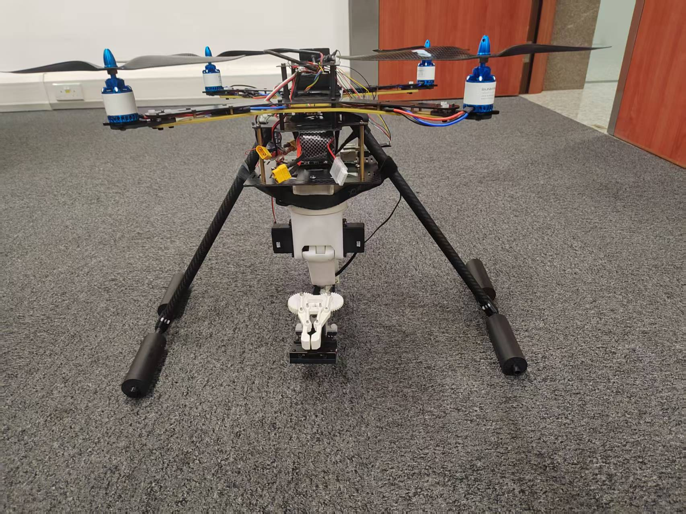
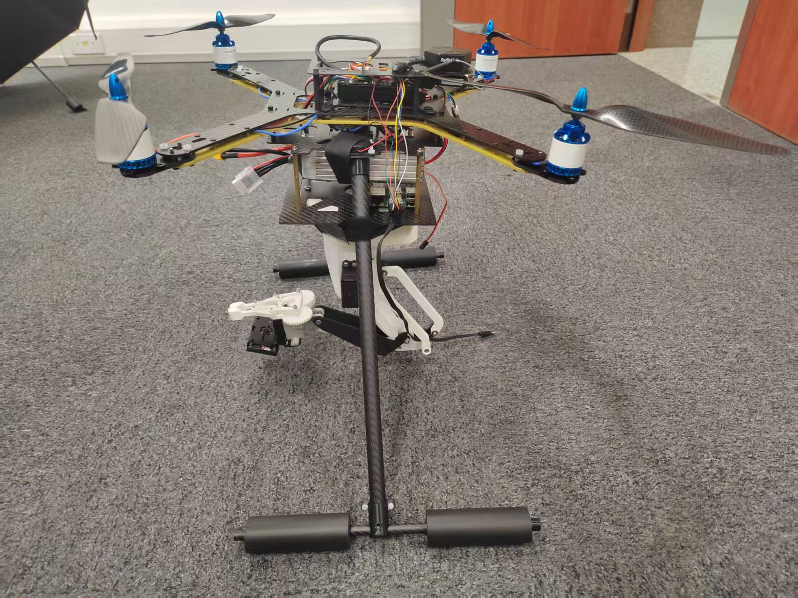
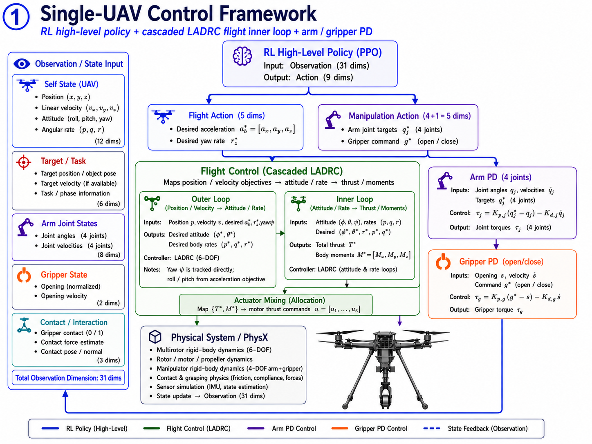
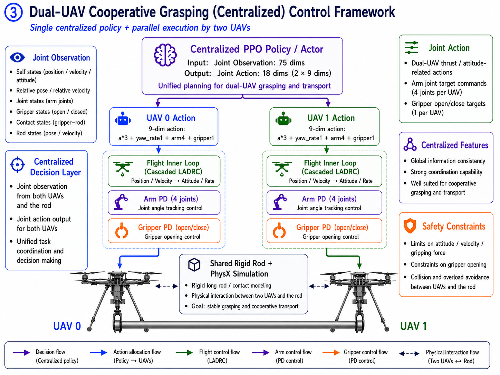
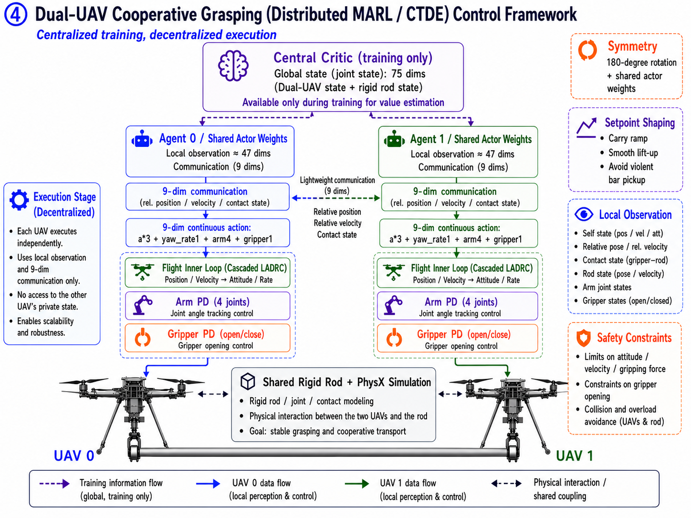

# Flyarm — 空中机械臂抓取与双机协作搬运

> 四旋翼 + 4 自由度机械臂 + 二指夹爪的空中操作（aerial manipulation）平台。
> 基于 **强化学习（RL）高层决策 + 串级 LADRC 鲁棒内环** 的混合控制架构，在 NVIDIA Isaac Lab（GPU 并行物理）中训练，
> 任务从单机抓取递进到**双机协作抓取与搬运**，并对比了**集中式**与**分布式（CTDE / MAPPO）**两种多机策略。

---

## 实机装配

FlyArm 四旋翼、机械臂与二指夹爪的实机装配照片。

| 装配视角一 | 装配视角二 |
|---|---|
|  |  |

---

## 视频演示

点击下方播放器即可在线观看四种任务的仿真回放。

### 单机抓取 · 旋转夹爪

https://github.com/user-attachments/assets/2feaf8e1-7562-4365-8179-b15f51524419

16 秒 · [查看原始视频](video/flyarm_ladrc_success_单机旋转夹爪.mp4)

### 单机抓取 · 平行夹爪

https://github.com/user-attachments/assets/decc949b-a991-43d2-ae42-240d548cd16b

12 秒 · [查看原始视频](video/rl-video-step-单机平行夹爪.mp4)

### 双机协作 · 集中式 PPO

https://github.com/user-attachments/assets/4af81a8f-510a-4cc1-98a6-b09a21211e7c

18 秒 · [查看原始视频](video/rl-video-step-集中式双机协作.mp4)

### 双机协作 · 分布式 MAPPO

https://github.com/user-attachments/assets/be383560-78b0-468a-8d94-290428423290

20 秒 · [查看原始视频](video/rl-video-step-分布式双机协作.mp4)

---

## 1. 项目概述

平台需要完成的动作链：**起飞悬停 → 飞到目标上方 → 伸展机械臂 → 竖直对准并夹取 → 抬升并带物体飞行**。
单机能力打通后，进一步研究**两台无人机协同夹持同一根长杆并搬运到指定位姿**——这是空中物流、协同吊运等场景的核心能力。

整个工作覆盖了从**机构建模（URDF）→ 飞控算法（串级 LADRC）→ 强化学习环境与奖励设计 → 多机协作（集中式 vs 分布式）**的完整链路。

| 阶段 | 任务 | 夹爪 | 控制 | 结果 |
|---|---|---|---|---|
| 单机 | 抓取 + 带物搬运 | 旋转 | 串级 LADRC | 抓取+抬升打通（坠机率 ~8%，物体从台面抬升至 ~0.6 m） |
| 单机 | 抓取 + 带物搬运 | 平行 | 串级 LADRC | 验证通过，平面大接触面、角度容差更优 |
| 双机·集中式 | 协同抓取共享杆 + 搬运到目标 | 平行 | 串级 LADRC ×2 | **成功率 100%**（两端同时夹住、抬离台面、搬运到目标并保持） |
| 双机·分布式 | 同上（CTDE / MAPPO） | 平行 | 串级 LADRC ×2 | **成功率 100%** |

> 集中式与分布式两版**任务定义、奖励、初始条件完全一致**，构成一组受控对比实验（centralized vs CTDE）。

---

## 2. 系统组成

- **机体**：四旋翼（升力以外力施加，旋翼仅做视觉旋转）。
- **机械臂**：底座 yaw 旋转 + 3 个俯仰关节（base_rotate / B / C / D 轴），末端二指夹爪。
- **夹爪**：两套机构
  - *旋转夹爪*（revolute）：两指绕轴旋转开合；
  - *平行夹爪*（prismatic）：两指平移、始终平行，夹持面为平面，角度容差大、对长杆更友好。
- **仿真**：Isaac Lab / Isaac Sim（PhysX GPU），1024+ 并行环境。
- **机构来源**：SolidWorks 装配体导出 URDF（见 `urdf/`），实物已 3D 打印装配。

---

## 3. 控制架构（核心）

采用 **“RL 高层决策 + 模型基鲁棒内环”** 的分层混合控制，而非让 RL 直接输出原始力矩（后者抗扰差、难收敛）：



图中展开的是策略动作前 4 维的飞行控制链路：**期望加速度 3 维 + 期望偏航率 1 维**。完整策略动作仍为 9 维，后 5 维分别进入机械臂 PD 位控与夹爪开合位控：

- **飞行**：RL 输出期望加速度 / 偏航率，串级 LADRC 将其转换为机体推力与三轴力矩，并通过 ESO 在线估计扰动、前馈补偿重心/负载影响。
- **机械臂**：4 个关节目标由策略增量给定，底层用 PD 位置控制跟踪。
- **夹爪**：策略给出开合指令，底层用 PD 位置控制执行夹持。

### 串级 LADRC（`flyarm/cascade_ladrc.py`）

线性自抗扰控制（Linear Active Disturbance Rejection Control），纯 torch 实现、4096 并行环境同步运算：

- **LESO（线性扩张状态观测器）**：实时估计每个轴的“总扰动”（机械臂伸展、磕碰、负载耦合带来的力矩），作为附加状态 `z2`。
- **LSEF 控制律**：`u = (wc·(ref − z1) − z2) / b0`，其中 `wc` 为控制带宽、`z1` 为状态估计、`z2` 为扰动估计、`b0 ≈ 1/转动惯量`。扰动 `z2` 被直接前馈抵消，因此无需积分项即可抑制稳态扰动。
- **级联结构**：外环（角度，~150 Hz 量级）给内环（角速率，~1 kHz 量级，对应真机 PX4 内环）提供设定值。
- **前馈补偿**：机械臂伸展会改变整机重心、夹住负载会引入耦合力矩——用**重心前馈 + 负载前馈**主动抵消，减轻 LESO 负担。
- **设计取向**：内环方程 / 增益 / 离散化 / 限幅与真机 PX4 内环保持一致，为 sim-to-real 移植做准备（`b0` 按挂臂后转动惯量重新标定）。

> 该架构对标空中操作领域的主流做法（RL 出 setpoint + 鲁棒内环），把“飞哪、怎么抓”交给学习，把“稳住姿态、抗机械臂扰动”交给可解释、可移植的控制器。

---

## 4. 强化学习环境设计

- **观测**：机体线/角速度、重力投影、目标方向、机械臂关节角与角速度、夹持中心→物体方向与距离、触觉接触力（全部转到机体系）。双机版额外包含杆位姿与两机相对位姿。
- **动作**：9 维（加速度 3 + 偏航率 1 + 机械臂 4 + 夹爪 1）；双机集中式为 18 维，分布式为每机 9 维。
- **奖励设计要点**：
  - **三阶段课程**：先锁臂稳定悬停 → 强制伸直机械臂 → 放开自由抓取，逐步引入难度；
  - **门控奖励**：抓取类奖励门控在“机械臂伸直 × 夹爪竖直”上，避免学出卷臂抢抓等捷径；
  - **抬升塑形**：从“接触即给抬升梯度”到“搬运到目标位姿并保持”的连续引导；
  - **触觉接触**：两指接触传感器给出真实抓握信号，治“空抓”。
- **感知层**：机身/腕部相机 + IBVS 像素误差，可选开启，为后续视觉伺服预留。

### 关键工程结论

- **夹爪开合轴必须垂直于被抓物体长轴**：抓各向同性方块时朝向无所谓，但抓细长杆时若开合轴顺着杆，两指会被杆挡住夹不进——通过把夹爪绕竖直轴旋转 90° 解决（这是双机平行夹爪打通 100% 成功率的决定性一步）。
- **夹持瞄准点 = 真实夹持面**，而非手指几何中心或关节中心（依据 3D 打印实测的夹持面位置反推）。
- **平行 vs 旋转夹爪**：平行夹爪平面接触、角度容差大，显著降低了双机对长杆的抓取难度。

---

## 5. 多机协作：集中式 vs 分布式

| | 集中式（centralized） | 分布式（CTDE / MAPPO） |
|---|---|---|
| 策略 | 一张网看两机拼接观测、出两机拼接动作 | 共享策略各喂**自身 egocentric 观测**、各出自身动作 |
| critic | —— | **中心化 critic**（训练期看全局 state，推理不参与） |
| 部署 | 需中央节点统一指挥 | **去中心化执行**（每机各跑一份网络） |
| 训练算法 | PPO (rsl_rl) | MAPPO (skrl) |
| 现状 | 成功率 100% | 成功率100% |

两机经 **yaw 镜像 + 全机体系观测** 做到任务对称，共享策略天然对称处理，无需 agent-ID。
这组对比的价值在于：集中式给出可达性上界，分布式给出**可真机部署**的方案，两者同任务同奖励，是一组干净的消融实验。

### 集中式双机控制框图



集中式版本使用一个联合 PPO 策略读取 75 维联合观测、输出 18 维联合动作（两台各 9 维），统一规划两台无人机的抓取与搬运；底层仍然是两套独立的串级 LADRC + 机械臂/夹爪 PD。

### 分布式 MAPPO / CTDE 控制框图



分布式版本训练时使用中心化 critic 读取全局 state，执行时每台无人机只依赖本机 egocentric 观测与 9 维轻量通信块，各自输出 9 维动作；两台通过共享策略权重、180° 对称化和 carry ramp 设定值整形实现同步协作。

---

## 6. 目录结构

```
flyarm_aerial_manipulation/
├── README.md
├── docs/
│   └── images/                         # README 控制架构图
│       ├── control_ladrc_flight.png
│       ├── control_coop_centralized.png
│       └── control_coop_marl_ctde.png
├── flyarm/                              # Isaac Lab 任务包（可作为 direct task 包导入）
│   ├── __init__.py                      # gym 任务注册（6 个任务）
│   ├── cascade_ladrc.py                 # 串级 LADRC 姿态控制器（纯 torch, 并行）
│   ├── flyarm_env.py                    # 单机基类：四旋翼 + 机械臂 + 夹爪 + 奖励/观测/动作
│   ├── flyarm_vision_env.py             # 扩展：触觉接触、抓取塑形、相机/IBVS 脚手架
│   ├── flyarm_ladrc_env.py              # 单机 · LADRC · 旋转夹爪
│   ├── flyarm_pg_ladrc_env.py           # 单机 · LADRC · 平行夹爪
│   ├── flyarm_coop_grasp_env.py         # 双机 · 集中式 · 旋转夹爪（基类）
│   ├── flyarm_pg_coop_grasp_env.py      # 双机 · 集中式 · 平行夹爪（成功率 100%）
│   ├── flyarm_coop_grasp_marl_env.py    # 双机 · 分布式 MARL（DirectMARLEnv 基类）
│   ├── flyarm_pg_coop_grasp_marl_env.py # 双机 · 分布式 MARL · 平行夹爪
│   └── agents/
│       ├── rsl_rl_ppo_cfg.py            # PPO 训练配置
│       ├── skrl_mappo_cfg.yaml          # MAPPO 配置（旋转夹爪）
│       └── skrl_mappo_pg_cfg.yaml       # MAPPO 配置（平行夹爪）
├── urdf/
│   ├── flyarm_rotary_gripper.urdf       # 旋转夹爪整机
│   ├── flyarm_parallel_gripper.urdf     # 平行夹爪整机
│   └── meshes/                          # STL 网格（含 parallel_gripper/）
└── assets_3d/                           # SolidWorks 装配体财产
```

---

## 7. 运行方法

依赖：NVIDIA Isaac Lab / Isaac Sim（PhysX GPU）、`rsl_rl`、`skrl`（分布式需 `gymnasium==0.29.1`）。
将 `flyarm/` 放入 Isaac Lab 的 `source/isaaclab_tasks/isaaclab_tasks/direct/` 下，将 URDF 转为 USD 后即可训练。

```bash
# 旋转夹爪 URDF → USD（改过 URDF 后执行；平行夹爪同理）
isaaclab.bat -p scripts/tools/convert_urdf.py  urdf/flyarm_rotary_gripper.urdf  .../flyarm/flyarm.usd  --headless

# 单机 · LADRC · 平行夹爪
isaaclab.bat -p scripts/reinforcement_learning/rsl_rl/train.py  --task Isaac-Flyarm-PgLadrc-Direct-v0  --headless --num_envs 1024

# 双机 · 集中式 · 平行夹爪（成功率 100%）
isaaclab.bat -p scripts/reinforcement_learning/rsl_rl/train.py  --task Isaac-Flyarm-PgCoopGrasp-Direct-v0  --headless --num_envs 1024

# 双机 · 分布式 MAPPO · 平行夹爪
isaaclab.bat -p scripts/reinforcement_learning/skrl/train.py  --task Isaac-Flyarm-PgCoopGrasp-MARL-v0  --algorithm MAPPO --headless --num_envs 1024

# 回放录像
isaaclab.bat -p scripts/reinforcement_learning/rsl_rl/play.py  --task Isaac-Flyarm-PgCoopGrasp-Direct-v0  --num_envs 4 --headless --video
```

注册的 6 个任务：

| Task ID | 说明 |
|---|---|
| `Isaac-Flyarm-Ladrc-Direct-v0` | 单机 · LADRC · 旋转夹爪 |
| `Isaac-Flyarm-PgLadrc-Direct-v0` | 单机 · LADRC · 平行夹爪 |
| `Isaac-Flyarm-CoopGrasp-Direct-v0` | 双机 · 集中式 · 旋转夹爪 |
| `Isaac-Flyarm-PgCoopGrasp-Direct-v0` | 双机 · 集中式 · 平行夹爪 |
| `Isaac-Flyarm-CoopGrasp-MARL-v0` | 双机 · 分布式 MARL · 旋转夹爪 |
| `Isaac-Flyarm-PgCoopGrasp-MARL-v0` | 双机 · 分布式 MARL · 平行夹爪 |

---

## 8. 技术栈

`Python` · `PyTorch` · `NVIDIA Isaac Lab / Isaac Sim (PhysX)` · `rsl_rl (PPO)` · `skrl (MAPPO / CTDE)` ·
`线性自抗扰控制 (LADRC)` · `URDF / USD 建模` · `SolidWorks`

---

## 9. 备注

- 上述结果均为仿真（Isaac Lab）中验证；控制内环按真机 PX4 结构设计，预留 sim-to-real 移植路径。
