# Flyarm 双机协同抓取：集中式 vs 分布式 MARL 对照笔记

> 本笔记根据当前项目代码整理：`flyarm_coop_grasp_env.py`、`flyarm_pg_coop_grasp_env.py`、`flyarm_coop_grasp_marl_env.py`、`flyarm_pg_coop_grasp_marl_env.py`、`cascade_ladrc.py` 和 `agents/` 训练配置。
>
> **棕色 = 分布式双机协同（MAPPO / CTDE）**，**绿色 = 集中式双机协同（PPO / centralized）**。

---

## 1. 概括

集中式和分布式两套任务的**物理对象、夹爪几何、底层飞控、抓取目标基本一致**，差别主要在高层决策拓扑：

- **集中式**：一个 PPO 策略一次看两台无人机和长杆的联合状态，一次输出两台机器的 18 维联合动作。优点是协调天然强，缺点是部署依赖中央节点。
- **分布式**：两台无人机各自作为一个 agent，每台只看本机 egocentric 观测 + 少量通信，用共享 actor 权重独立执行；训练时用中心化 critic 看全局 state。优点是更接近真机部署，难点是“同时夹住、同步抬升”更难。

从这组曲线看，**两者最后都能达到接近 100% success_rate**；

---

## 2. 任务与代码入口

| 对照项 | 集中式双机协同 | 分布式双机协同 |
|---|---|---|
| Task ID | `Isaac-Flyarm-PgCoopGrasp-Direct-v0` | `Isaac-Flyarm-PgCoopGrasp-MARL-v0` |
| 主环境 | `flyarm_pg_coop_grasp_env.py` | `flyarm_pg_coop_grasp_marl_env.py` |
| 基类 | `FlyarmCoopGraspEnv` | `FlyarmCoopGraspMarlEnv` |
| RL 算法 | PPO (`rsl_rl`) | MAPPO (`skrl`) |
| 执行方式 | 单策略集中控制两机 | 两个 agent 去中心化执行 |
| Critic | PPO 普通 critic，输入联合观测 | 中心化 critic，训练时输入全局 state |
| Actor 权重 | 一张联合 actor | 两机共享 actor 权重 |
| 训练日志目录 | `flyarm_pg_coop_grasp` | `flyarm_pg_coop_grasp_marl` |

---

## 3. 高层架构对照

| 项目 | 集中式 | 分布式 MAPPO / CTDE | 参数意义 |
|---|---|---|---|
| `action_space` | 18 | 每机 9 | 动作维度。集中式一次输出两台机器动作；分布式每台输出自己的动作。 |
| `observation_space` | 75 | 每机 47 | 集中式 actor 直接看联合观测；分布式 actor 只看局部观测。 |
| `state_space` | 0 | 75 | 分布式中心化 critic 用的全局 state；执行时不使用。 |
| agent 数 | 隐含 2 台 | `["drone_0", "drone_1"]` | 分布式环境显式声明两个 agent。 |
| 策略输入 | `32×2 + 共享11 = 75` | `own32 + 杆状态6 + 通信9 = 47` | 分布式每台没有全局视角，只拿本机可观测量和队友广播。 |
| 策略输出 | `2×9 = 18` | 每机 9 | 每台的 9 维动作语义一致。 |
| 奖励分账 | 全部 reward 汇成一个总 reward | 个人项归个人，共享协作项两机同发 | MAPPO 里每个 agent 都有 reward，但协作任务需要共享项推动同步。 |
| 部署含义 | 需要中央电脑拿到两机状态并统一下发动作 | 每台机载策略独立跑，只交换少量信息 | CTDE 的核心：集中训练，去中心化执行。 |

### 分布式 47 维观测拆解

代码里分布式每台 agent 的观测是：

```text
47 = own32 + 本机可测杆状态6 + 队友通信9
```

| 观测块 | 维度 | 含义 |
|---|---:|---|
| `own32` | 32 | 本机状态、目标方向、臂/夹爪状态、两指接触力等。 |
| 杆状态 | 6 | 杆线速度 3 + 杆 z 轴方向 3，全部转到本机体系。 |
| 队友通信 | 9 | 队友相对位置 3、相对速度 3、队友是否夹住 1、队友是否正在合爪 1、队友末端到目标距离 1。 |

中心化 critic 的全局 state 是：

```text
75 = own32(无人机0) + own32(无人机1) + 共享11
共享11 = 杆线速度3 + 杆z轴3 + 两机相对位置3 + 两机接触状态2
```

---

## 4. 动作参数含义

每台无人机的动作都是 9 维：

```text
[a_x, a_y, a_z, yaw_rate, base_rotate, axis_B, axis_C, axis_D, gripper]
```

| 参数 | 值 / 规则 | 意义 |
|---|---:|---|
| `accel_scale` | `3.0` | 策略输出的前三维乘以 3，作为世界系期望加速度，交给 LADRC 变成推力和姿态目标。 |
| `yaw_rate_scale` | `1.5` | 第 4 维动作乘以 1.5，作为期望偏航角速度。 |
| `arm_speed_scale` | `1.0` | 机械臂 4 个关节是增量位置控制：`target += action × arm_speed_scale × dt`。 |
| `gripper` | `>=0` 闭合，`<0` 张开 | 二值开合命令。对平行夹爪来说，闭合目标是 0 m，张开目标是 0.017 m。 |
| `dt` | `0.02 s` | 物理 `100 Hz`，`decimation=2`，所以 RL 控制频率为 `50 Hz`。 |

集中式一次输出：

```text
18 = 9(无人机0) + 9(无人机1)
```

分布式每个 agent 输出：

```text
9 = 本机动作
```

---

## 5. 底层飞控与动力学参数

两种双机任务底层飞控都复用 **Cascade LADRC**，区别不在飞控公式，而在高层策略如何给 setpoint。

| 参数 | 当前值 | 具体意义 |
|---|---:|---|
| `thrust_to_weight` | `1.9` | 最大推力上限 = 1.9 倍总重。总重由 PhysX 自动求和，包含机体与机械臂。 |
| `ladrc_in_wc_rp` | `10.5` | roll/pitch 角速率内环控制带宽。越大响应越快，但太大会抖。 |
| `ladrc_in_wo_rp` | `15.0` | 双机任务中 roll/pitch 内环 ESO 观测器带宽。原单机历史值是 40，双机降到 15 是为了减小噪声放大和力矩抖动。 |
| `ladrc_in_b0_rp` | `80.0` | roll/pitch 内环输入增益，近似 `1/Jxx`。J 越大，b0 应越小。 |
| `ladrc_in_wc_yaw` | `8.0` | yaw 角速率内环控制带宽。 |
| `ladrc_in_wo_yaw` | `13.0` | yaw 内环 ESO 观测器带宽。 |
| `ladrc_in_b0_yaw` | `130.0` | yaw 输入增益，近似 `1/Jzz`。 |
| `ladrc_out_wc` | `2.0` | 外环角度控制带宽。外环把期望 roll/pitch 转成期望角速率。 |
| `ladrc_out_wo` | `8.1` | 外环角度 ESO 带宽。 |
| `ladrc_out_b0` | `1.0` | 角度环输入增益，近似 `角速度 -> 角度变化`，所以取 1。 |
| `ladrc_max_angle` | `0.61 rad` | 外环姿态设定值限幅，约 35 度，防止策略要求过大倾角。 |
| `ladrc_max_rate` | `4.0 rad/s` | 内环角速度设定值限幅。 |
| `ladrc_moment_sign` | `1.0` | 力矩符号兜底；若一上电反向翻滚，可改成 `-1.0`。 |
| `z2_clamp_in_rp` | `0.3 × b0 = 24` | roll/pitch 总扰动估计限幅，单位可理解为 rad/s²。 |
| `z2_clamp_in_yaw` | `0.2 × b0 = 26` | yaw 总扰动估计限幅。 |
| `use_cog_feedforward` | `True` | 打开重心前馈，提前补偿机械臂伸展造成的重心偏移力矩。 |
| `cog_ff_gain` | `0.6` | 重心前馈增益。越大补偿越强，符号错会让姿态变差。 |
| `use_payload_feedforward` | `True` | 配置项为真。分布式 MARL 代码中实际调用持杆负载前馈；集中式基类定义了该项，但 `_pre_physics_step` 主要调用重心前馈。 |
| `payload_mass_per_drone` | `0.075 kg` | 每台无人机理论承担半根 0.15 kg 杆的重量。分布式里用于额外推力和负载力矩前馈。 |
| `payload_ff_gain` | `1.0` | 持杆负载前馈增益；符号不对时可改成负值或关掉。 |

PPO/MAPPO 不直接学四个电机出多少力，而是学“我想往哪里加速、我想怎么偏航”。LADRC 负责把这个高层意图变成推力和力矩，并用 ESO 把机械臂、夹杆带来的扰动估出来减掉。

---

## 6. 长杆、夹爪与几何参数

| 参数 | 当前值 | 具体意义 |
|---|---:|---|
| `bar_length` | `1.2 m` | 共享长杆长度。 |
| `bar_thickness` | `0.04 m` | 长杆截面厚度，约 4 cm。 |
| `bar_mass` | 基类 `0.15 kg`，平行夹爪任务改为 `0.5 kg` | 平行夹爪协同任务把杆加重，避免轻杆被单次接触碰飞。 |
| `bar_grasp_x` | `0.5 m` | 每台机抓杆端附近的位置；杆半长 0.6 m，抓点距中心 0.5 m，即每端内缩约 0.1 m。 |
| `pedestal_height` | `0.20 m` | 支撑台面高度，也用于掉落判定。 |
| `hover_offset` | `0.45 m` | 无人机目标悬停高度 = 杆/物体高度 + 0.45 m。 |
| `carry_height` | `0.12 m` | 抓住后搬运目标比杆初始高度高 12 cm。 |
| `lift_height` | `0.05 m` | 杆抬起超过 5 cm 后，认为进入有效抬升区。 |
| `gripper_open` | `(0.017, 0.017) m` | 平行夹爪张开目标。两指都到行程上限，能罩住 4 cm 杆。 |
| `gripper_close` | `(0.0, 0.0) m` | 平行夹爪闭合目标。真正夹紧力由接触干涉和 effort limit 决定。 |
| `gripper stiffness` | `2000 N/m` | 平移夹爪位置控制刚度。数值越大，碰到杆后夹紧力越强。 |
| `gripper damping` | `50 Ns/m` | 夹爪阻尼，抑制快速开合时的振荡。 |
| `gripper_effort_limit_2b` | `10 N` | 每个夹爪关节最大力。平面接触不容易扎穿，所以可以用 10 N 稳定夹杆。 |
| `grasp_offset` | `(0.12, 0.0, 0.02)` | 腕部坐标系下真实夹持面中心。奖励和对准都瞄这里，而不是 link 原点。 |
| `grasp_z_offset` | `-0.01 m` | 抓取目标下移 1 cm，避免指尖骑到杆上表面。 |
| `base_rotate_center` | `-1.1208 rad` | 平行夹爪绕竖直轴转 90 度，让夹爪开合轴垂直于长杆。 |
| `base_rotate_clamp` | `0.3 rad` | base_rotate 只能在中心附近 ±0.3 rad 内动作，防止整臂大幅甩动机身。 |
| `arm_stow` | `(-1.1208, -0.41, 0.35, -0.10)` | 起飞/settle 阶段机械臂蜷缩姿态。平行夹爪任务把 base_rotate 与新中心对齐。 |
| `arm_straight_target` | `(0.0, -1.48)` | B/C 两关节的直臂目标，搬运时也会把臂锁到直臂姿态。 |
| `pg_near_grasp_clearance` | `0.08 m` | 近抓取课程中，reset 时把无人机整体抬高 8 cm，让张开的夹爪悬在杆上方，避免第一帧穿模碰撞。 |

**关键几何结论**：双机抓长杆时，夹爪开合轴必须垂直于杆轴。单机抓方块时方向不敏感，但抓长杆如果开合轴顺着杆，两指会被杆挡住，怎么学都夹不进去。

---

## 7. 搬运、成功与课程参数

| 参数 | 当前值 | 具体意义 |
|---|---:|---|
| `contact_force_threshold` | `0.2 N` | 认为手指接触到物体/长杆的主阈值。 |
| `contact_weak_threshold` | `0.02 N` | 弱指阈值。要求强指 > 0.2 N 且弱指 > 0.02 N，避免单指碰一下就算抓住。 |
| `contact_hold_steps` | `5` | 接触去抖窗口。最近 5 步内出现过双指接触，就认为该机还 held，防止 PhysX 接触力逐帧闪烁切断奖励。 |
| `carry_trigger` | `0.01 m` | 两机夹住且杆抬高超过 1 cm 后进入搬运态。 |
| `carry_release` | `0.002 m` | 杆掉回 0.2 cm 以下才退出搬运态，形成滞回，防止 carry 状态反复开关。 |
| `carry_ramp_steps` | 集中式 `0`，分布式 `60` | 搬运目标 z 是否平滑抬升。分布式用 60 步约 1.2 s 的 ease-out 斜坡，避免目标高度瞬跳把杆甩飞。 |
| `success_dist` | `0.10 m` | 杆中心距离搬运目标小于 10 cm 才满足成功位置条件。 |
| `success_tilt` | `0.05` | 杆姿态倾斜阈值。代码用四元数 x/y 分量平方和近似倾斜。 |
| `success_hold_steps` | `50` | 成功条件连续保持 50 步，即 1 秒。 |
| `use_hold_curriculum` | 集中式 `False`，分布式 `True` | 分布式训练时先放宽 hold_bonus 判定，再逐步收紧到严格成功阈值。 |
| `hold_curric_steps` | `120000` | hold 阈值从宽到严的收紧步数。 |
| `hold_loose_dist` | `0.20 m` | hold_bonus 初期宽松距离阈值。 |
| `hold_loose_tilt` | `0.15` | hold_bonus 初期宽松倾斜阈值。 |
| `lift_gate_transport_rewards` | 集中式 `False`，分布式 `True` | 分布式把 `bar_goal` / `hold_bonus` 乘上离台进度，防止“夹住躺着不抬”也拿搬运奖励。 |

---

## 8. 奖励项含义

奖励分两类：**单机个人项**和**双机共享协作项**。集中式把它们加成一个总 reward；分布式把个人项给对应 agent，共享项同时给两个 agent。

### 8.1 个人项：每台无人机自己要做好什么

| 奖励项 | 权重 / 参数 | 意义 |
|---|---:|---|
| `dist_to_goal` | `8.0` | 无人机飞到自己目标点附近。基础飞行对位奖励。 |
| `orientation` | `-8.0` | 姿态偏差惩罚，防翻滚。 |
| `reaching` | `4.0` | 夹持中心靠近自己要抓的杆端。 |
| `finger` | `2.0` | 远处闭爪扣分，近处闭爪加分，引导“靠近后再夹”。 |
| `gripper_vertical` | `4.0` | 夹爪保持竖直，减少斜抓。 |
| `arm_straight` | `5.0` | 机械臂伸直到抓取姿态。 |
| `align` | `3.0` | 夹爪开合轴与杆轴尽量垂直。数值来自 `1 - |finger_axis · bar_axis|`。 |
| `grasp_close` | `6.0` | 到杆附近并且对齐时闭合夹爪。 |
| `contact_grasp` | `8.0` | 真实双指接触奖励，是“真夹住”的核心信号。 |
| `own_end_lift` | `30.0`，cap `0.03 m` | 自己那端杆被抬高一点就给连续奖励，用来启动抬升。 |
| `touch` | `1.5` | 任一手指接触到杆的面包屑奖励。 |
| `weak_grip` | 集中式平行夹爪 `3.0`，基类默认 `0.0` | 用弱指力 `min(左,右)` 做连续奖励，避免一指碰到但另一指悬空。 |
| `progress` | `8.0` | 末端到目标距离变小才给分，避免原地抖动刷分。 |
| `engagement` | `2.0` | 末端进入 3 cm 内，鼓励真正贴近。 |
| `lin_vel` | `-0.05` | 线速度惩罚，别乱飘。 |
| `ang_vel` | `-0.02` | 角速度惩罚，别乱转。 |
| `action_rate` | `-1e-4` | 动作变化率惩罚，让动作更平滑。 |
| `joint_vel` | `-1e-4` | 机械臂关节速度惩罚，抑制乱挥。 |

### 8.2 共享项：两机一起才拿到

| 奖励项 | 权重 / 参数 | 意义 |
|---|---:|---|
| `grasp_lift` | `30.0` | 两机都夹住后，杆离台高度越高给越多。 |
| `lift_goal` | `16.0`，`std=0.10` | 两机夹住后，把杆往 `carry_height` 高度目标拉。 |
| `lifting` | `15.0` | 杆抬高超过 `lift_height=5cm` 的稀疏奖励。 |
| `bar_goal` | `8.0`，`alpha=1.5` | 杆中心接近搬运目标。 |
| `bar_level` | `4.0` | 两机夹住后让杆保持水平。 |
| `bar_level_pre` | `1.5` | 分布式里抓齐前也鼓励杆水平，防止先抓那台把杆翘起来害队友。 |
| `hold_bonus` | `15.0` | 杆到目标且水平且两机夹住时的保持奖励。 |
| `internal` | `-0.5` | 惩罚两机沿杆轴相对拉扯，等价于内力代理。 |
| `bar_still` | `-0.5` | 两机没夹齐前惩罚杆乱动，让先接触那台稳住等待。 |
| `coop_ready` | 平行夹爪 `1.0` | 两台都到各自杆端附近。集中式平行夹爪把它削弱，避免死锁。 |
| `coop_close` | 平行夹爪 `1.0` | 两台都准备好并合爪。也被削弱，避免强迫同帧动作。 |
| `coop_grasp` | `6.0` | 两机都夹住，协作原语真正成立。 |
| `coop_descend` | `0.0` | 保留项，当前关闭。 |

### 8.3 奖励数值上下限怎么理解

代码里 TensorBoard 的 `Episode_Reward/*` 不是一整局的原始总和，而是：

```text
日志值 = 本回合该奖励项逐步累加值 / episode_length_s
episode_length_s = 15 s
step_dt = 0.02 s
```

所以对大多数形如 `reward = score × weight × dt` 的奖励来说，如果某个条件一整局都满足，TensorBoard 上看到的平台值大约就是 `weight`。例如 `coop_grasp` 权重是 6，如果两机几乎全程都夹住，曲线会接近 6；如果曲线在 5.4 左右，就可以粗略理解为“约 90% 时间处于联合夹持状态”。

#### 个人奖励上下限

| 奖励项 | 公式直觉 | 理论范围（TensorBoard 平台值） | 怎么解读 |
|---|---|---:|---|
| `dist_to_goal` | `8 × (1/(1+d²))²` | `(0, 8]` | d=0 时满分 8；d=0.5m 时约 5.1；d=1m 时约 2。 |
| `orientation` | `-8 × (机身倾斜量)` | `[-8, 0]` | 越接近 0 越水平；负得越多说明机身越歪。 |
| `reaching` | `4 × (1 - tanh(ee_dist/0.2))` | `[0, 4]` | 末端贴近杆端才高；0.2m 外会明显衰减。 |
| `finger` | `2 × 近处闭爪 - 2 × 远处闭爪` | `[-2, 2]` | 远处乱闭爪扣分，近处闭爪加分。 |
| `gripper_vertical` | `4 × 夹爪竖直度` | `[0, 4]` | 夹爪越竖直越接近 4。 |
| `arm_straight` | `5 × 直臂相似度` | `[0, 5]` | 机械臂越接近直臂抓取姿态越高。 |
| `align` | `3 × (1 - |夹爪开合轴·杆轴|)` | `[0, 3]` | 夹爪开合轴垂直于杆时接近 3；顺杆时接近 0。 |
| `grasp_close` | `6 × 到位 × 闭爪 × 门控` | `[0, 6]` | 到杆端、竖直、对齐后闭合夹爪才给。 |
| `contact_grasp` | `8 × 双指接触 × 门控` | `[0, 8]` | 真正双指夹住的核心奖励。 |
| `own_end_lift` | `30 × min(本端抬升, 0.03m)` | `[0, 0.9]` | 注意它不是 30 分上限，因为抬升高度只按米计且封顶 3cm。 |
| `touch` | `1.5 × 接触 × 门控` | `[0, 1.5]` | 接触面包屑，帮助从“靠近”过渡到“真夹住”。 |
| `weak_grip` | `3 × min(弱指力/1N, 1)` | `[0, 3]` | 平行夹爪启用；弱指也有力才高，防单指按压。 |
| `engagement` | `2 × (ee_dist < 3cm)` | `[0, 2]` | 末端进入杆端 3cm 内才给。 |
| `progress` | `8 × 每步距离缩短量`，每步 clamp 到 2cm | 实际通常 `0~数分`，极限约 `8` | 它没有乘 `dt`，等价于按“接近速度”给分；持续以 1m/s 靠近时约到 8。 |
| `lin_vel` | `-0.05 × min(|v|², 100)` | `[-5, 0]` | 线速度越大扣分越多，封顶 -5。 |
| `ang_vel` | `-0.02 × min(|ω|², 100)` | `[-2, 0]` | 角速度越大扣分越多，封顶 -2。 |
| `action_rate` | `-1e-4 × Δaction²` | 无严格下限 | 动作变化越剧烈越扣分；动作未硬裁剪时数学上无固定下限。 |
| `joint_vel` | `-1e-4 × min(关节速度², 100)` | `[-0.01, 0]` | 机械臂关节乱动惩罚，幅度较小。 |
| `crash` | `-50 × crash_intensity` | `[-50, 0]` | 离地太低或飞太高时强惩罚。 |

#### 共享奖励上下限

| 奖励项 | 公式直觉 | 理论范围（TensorBoard 平台值） | 怎么解读 |
|---|---|---:|---|
| `grasp_lift` | `30 × min(杆抬升, 0.05m) × all_contact` | `[0, 1.5]` | 两机都夹住后，杆离台越高越高；5cm 封顶。 |
| `lift_goal` | `16 × (1 - tanh(距抬升目标高度/0.10)) × all_contact` | `[0, 16]` | 把杆往 `carry_height=12cm` 目标高度拉；越接近目标越接近 16。 |
| `lifting` | `15 × 是否抬过5cm × all_contact` | `[0, 15]` | 稀疏抬升大奖励。 |
| `bar_goal` | `8 × exp(-1.5 × 杆到目标距离)` | `(0, 8]` | 杆中心越接近搬运目标越高；分布式还乘 `lift_gate`，躺在台面上不给满分。 |
| `bar_level` | `4 × exp(-杆倾斜/0.05) × all_contact` | `(0, 4]` | 杆越水平越接近 4；曲线 3.6 约等于 90% 上限。 |
| `bar_level_pre` | `1.5 × 杆水平 × 未全接触` | `[0, 1.5]` | 分布式额外项，抓齐前也别把杆翘起来。 |
| `hold_bonus` | `15 × 到目标 × 水平 × all_contact` | `[0, 15]` | 最接近最终成功判据；分布式早期用宽松课程，但 success 指标仍严格。 |
| `internal` | `-0.5 × min(沿杆轴相对速度, 10)` | `[-5, 0]` | 两机沿杆互相拉扯越大扣分越多。 |
| `bar_still` | `-0.5 × min(杆速度, 5) × 未全接触` | `[-2.5, 0]` | 两机没夹齐前别把杆拖成移动靶。 |
| `coop_ready` | `1 × 两机都到位` | `[0, 1]` | 平行夹爪版削弱到 1，防止强迫同帧到位造成死锁。 |
| `coop_close` | `1 × 两机都到位且都闭爪` | `[0, 1]` | 平行夹爪版也削弱到 1。 |
| `coop_grasp` | `6 × all_contact` | `[0, 6]` | 两机联合夹持奖励；曲线 5.5 已经很接近满分。 |

#### 曲线数值

| 曲线 | 上限参考 | 当前图中读法 |
|---|---:|---|
| `Episode_Reward/coop_grasp` | 6 | 后期 5.5 左右，说明绝大部分时间两机都夹住。 |
| `Episode_Reward/bar_level` | 4 | 后期 3.5~3.7，说明杆基本水平。 |
| `Episode_Reward/hold_bonus` | 15 | 后期 12~13，说明大量回合能到目标附近并保持，但仍有少量掉线。 |
| `Metrics/all_contact_frac` | 1 | 后期约 0.8，说明一个回合里约 80% 时间处于瞬时双机联合接触。 |
| `Metrics/success_rate` | 1 | 接近 1 就是严格成功率接近 100%。 |

---

## 9. 集中式与分布式的关键差异

### 9.1 集中式：一个大脑统一指挥

集中式 PPO 的特点：

- actor 输入 75 维联合观测。
- actor 输出 18 维联合动作。
- 两机协调是网络内部直接学出来的，天然知道“队友在哪里、杆怎么样、该不该一起抬”。
- 适合先验证任务可达性，作为上界 baseline。

代码重点：

```text
FlyarmPgCoopGraspEnv
  -> FlyarmCoopGraspEnv
  action_space = 18
  observation_space = 75
```

### 9.2 分布式：训练看全局，执行靠本机

分布式 MAPPO 的特点：

- 每台无人机是一个 agent：`drone_0` / `drone_1`。
- 每台 actor 输入 47 维本机观测。
- 两台共享 actor 权重，配合 180 度 yaw 镜像，让两台从自己的视角看任务是对称的。
- critic 训练时看 75 维全局 state，执行时不用。
- 额外加入 `carry_ramp`、`lift_gate`、`hold_curriculum`，专门解决去中心化执行中的同步和目标跳变问题。

代码重点：

```text
FlyarmPgCoopGraspMarlEnv
  -> FlyarmCoopGraspMarlEnv
  action_spaces = {"drone_0": 9, "drone_1": 9}
  observation_spaces = {"drone_0": 47, "drone_1": 47}
  state_space = 75
```

---

## 10. 训练配置对照

| 参数 | 集中式 PPO (`rsl_rl`) | 分布式 MAPPO (`skrl`) | 意义 |
|---|---:|---:|---|
| seed | `42` | `42` | 随机种子。 |
| rollout 长度 | `24` | `24` | 每个 env 每次更新采样多少步。 |
| learning epochs | `5` | `5` | 每批 rollout 重复学习几轮。 |
| mini batches | `4` | `4` | 每次 PPO 更新分成几批。 |
| learning rate | `3e-4` | `3e-4` | 学习率。 |
| gamma | `0.99` | `0.99` | 折扣因子，越接近 1 越重视远期奖励。 |
| lambda | `0.95` | `0.95` | GAE 优势估计参数。 |
| clip | `0.2` | `0.2` | PPO ratio 裁剪范围，防止策略一次更新太大。 |
| value clip | 开启 clipped value loss | `value_clip=0.2` | 限制价值函数更新幅度。 |
| entropy | `0.001` | `0.001` | 探索强度。双机动作维度大，熵系数减半防止乱甩。 |
| 网络 | `[256, 256, 128]` | `[256, 256, 128]` | actor/critic MLP 隐藏层。 |
| 激活函数 | `elu` | `elu` | 非线性激活函数。 |
| 观测归一化 | 开启 | RunningStandardScaler | 让不同量纲的输入更容易训练。 |
| checkpoint | `save_interval=200` | `checkpoint_interval=4800` | 保存模型频率。 |

---

## 11. 曲线逐项解读

### 11.1 `Episode_Reward/bar_level`

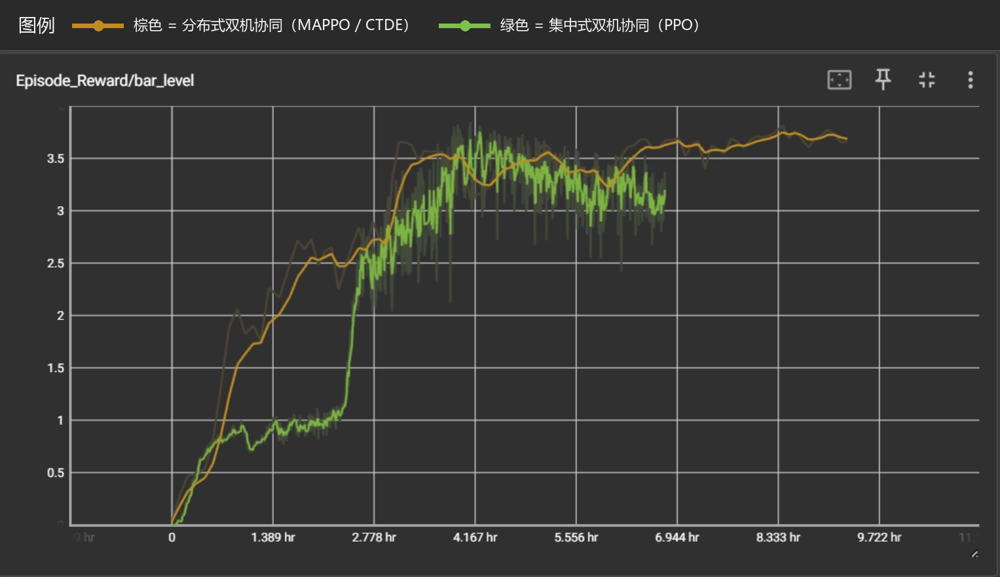

**含义**：杆保持水平的奖励。代码里用杆姿态倾斜量计算，越水平奖励越高。

观察：

- 棕色分布式较早上升并稳定在约 3.5 以上，说明 carry/hold 阶段能较早保持杆水平。
- 绿色集中式在约 2.7h 后快速上升，后期也进入 3.0 以上，但波动更明显。

解读：分布式虽然决策更难，但 `bar_level_pre`、`carry_ramp`、对称观测等修复让它很早学到“不要把杆翘起来”。

### 11.2 `Episode_Reward/coop_grasp`

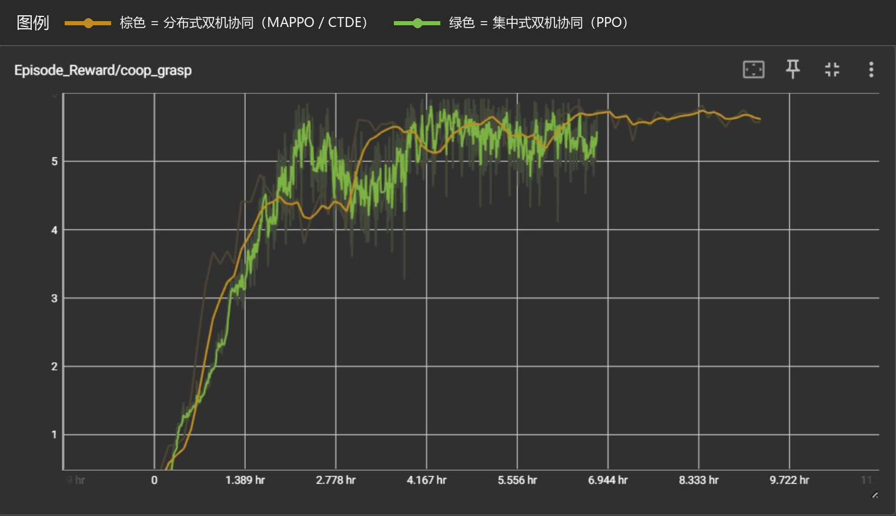

**含义**：两机都夹住长杆时的协作抓取奖励。它不是单机接触，而是联合事件。

观察：

- 两条曲线最终都在 5 以上，说明两机联合夹持都打通了。
- 棕色更早进入高平台，绿色后期也追上，但原始波动较大。

解读：`coop_grasp` 是判断“双机协作原语是否学会”的关键奖励。它起来以后，后面的抬升和保持才有意义。

### 11.3 `Episode_Reward/hold_bonus`

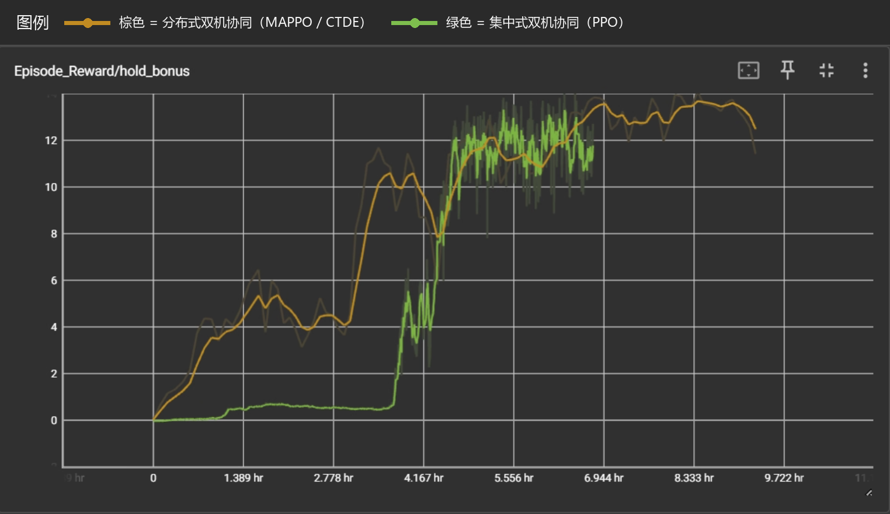

**含义**：杆到目标附近、水平、两机都夹住并保持时的奖励。它接近最终 success 判据。

观察：

- 棕色分布式很早获得 hold_bonus，并逐步到 12 左右。
- 绿色集中式前期几乎没有 hold_bonus，约 4h 后突然跃迁，说明终于学会“抬到目标并保持”。

解读：分布式里 `use_hold_curriculum=True`，早期先用宽松阈值发 hold_bonus，再逐渐收紧，所以更容易启动“保持”行为。success_rate 仍使用严格阈值，因此指标可比。

### 11.4 `Episode_Termination/died`

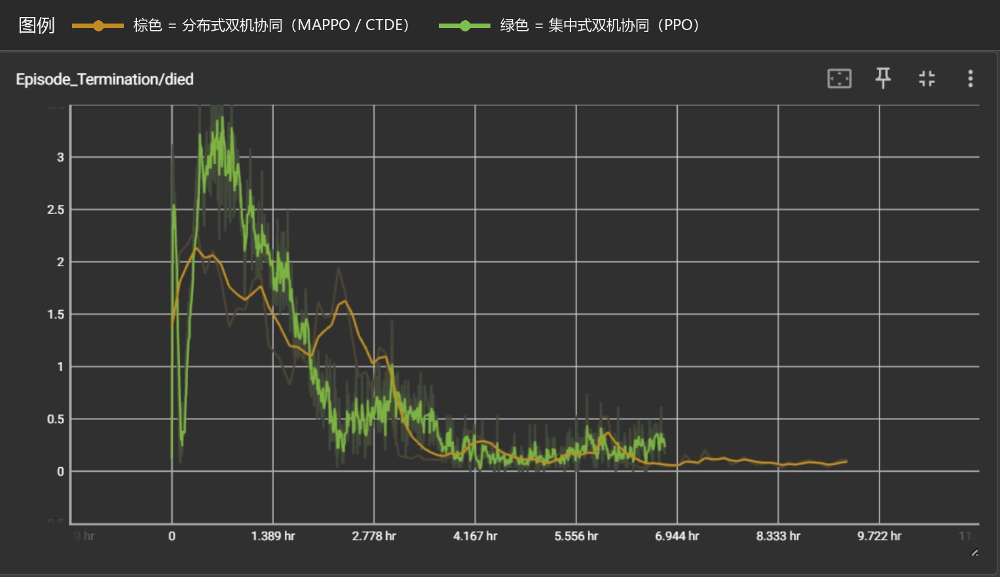

**含义**：每次统计窗口中因坠机、飞太高、速度发散、目标偏离过远、杆掉台等提前终止的回合数。

观察：

- 两者早期都有 died，高说明策略还不会稳飞/稳抓。
- 随训练推进，两者都下降到接近 0。

解读：LADRC + 重心前馈 + 动作/速度惩罚最终把飞行稳定住了。died 下降是“能安全训练下去”的基础。

### 11.5 `Metrics/all_contact_frac`

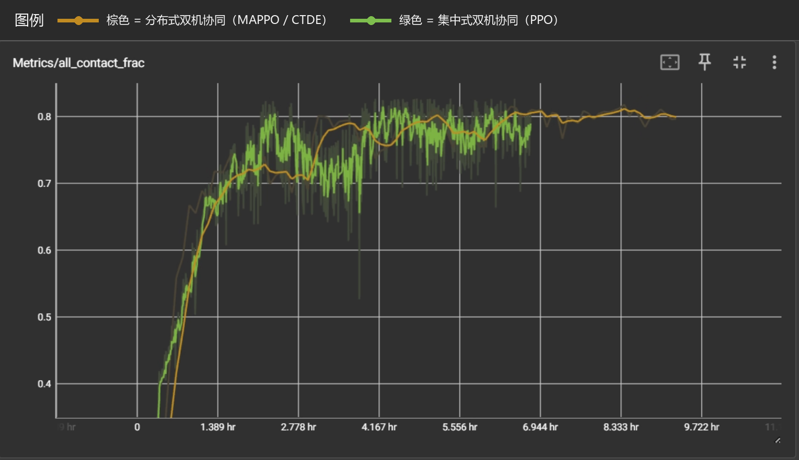

**含义**：一个回合里“两机瞬时都满足双指接触”的时间占比。

观察：

- 两者最终都接近 0.8，说明大部分时间两机都能同时夹住。
- 早期上升越快，说明越早解决“同时性”问题。

解读：如果 `contact_rate_0/1` 高但 `all_contact_frac` 低，说明两台各自能夹住，但不是同时夹住；如果 `all_contact_frac` 高但 `success_rate` 低，说明能夹住但搬运/保持还没学会。

### 11.6 `Metrics/contact_rate_0`

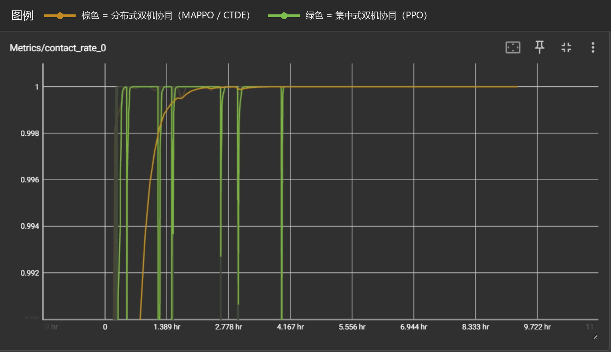

**含义**：无人机 0 在本回合是否曾经夹住过杆端的比例。

观察：

- 两者都很快接近 1。
- 绿色集中式有一些瞬时掉线，但总体也接近满分。

解读：无人机 0 的单端抓取不是瓶颈。真正难的是两台同时夹住和一起抬。

### 11.7 `Metrics/contact_rate_1`

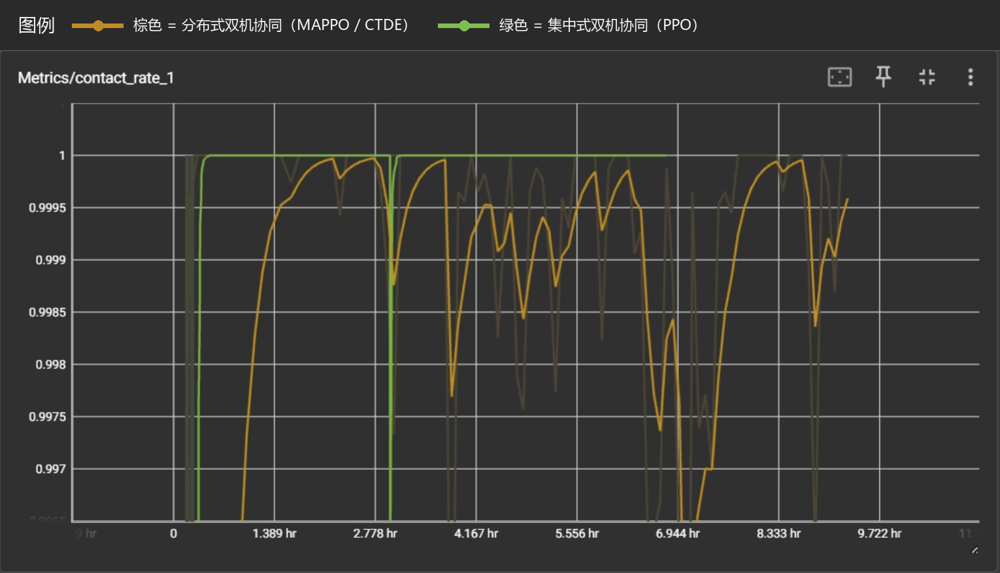

**含义**：无人机 1 在本回合是否曾经夹住过杆端的比例。

观察：

- 绿色集中式很快贴近 1。
- 棕色分布式也基本在 0.997 以上，后期有小幅波动。

解读：两端单独抓取都已打通；如果 success 没上去，不该再优先调夹爪接触，而应看 carry、hold、bar_level 和 internal。

### 11.8 `Metrics/max_bar_height`

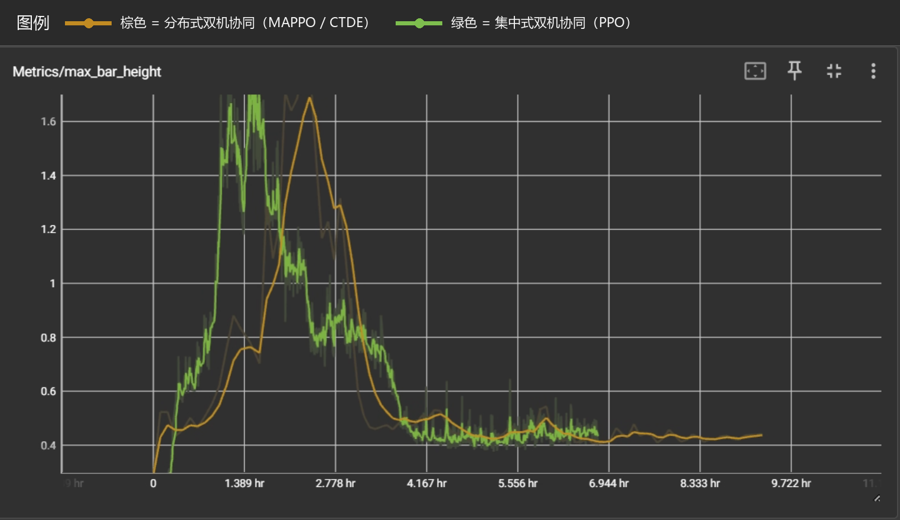

**含义**：本回合杆到过的最高 z 高度。分布式里日志对极端值做了 `clamp(max=2.0)`，避免发散环境拉爆均值。

观察：

- 早期绿色/棕色都出现 1.6 m 以上高峰。
- 后期都回到约 0.4 m 附近稳定。

解读：这里**不是越高越好**。早期高峰往往是碰撞、甩杆、约束爆炸或猛抬导致杆飞高；后期稳定到目标附近才是好现象。真正成功要看 `success_rate`，不是看 max height。

### 11.9 `Metrics/max_weak_finger_0`

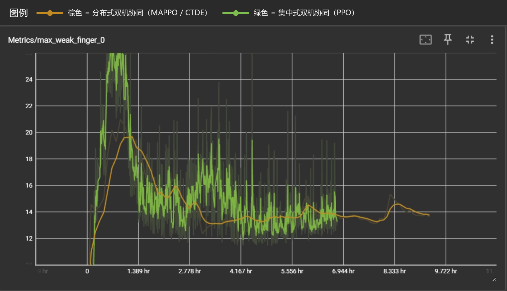

**含义**：无人机 0 两指中较弱那根手指在本回合达到过的最大接触力。用 `min(left_force, right_force)` 看“弱指有没有真的参与夹持”。

观察：

- 早期绿色峰值很高，说明接触冲击较大。
- 后期两者都落到十几 N 的稳定区间。

解读：如果该值长期接近 0，说明只有一根手指碰杆；如果过高且伴随 died/max_bar_height 尖峰，说明夹爪/杆发生强碰撞。现在后期数值说明两指夹持成立。

### 11.10 `Metrics/max_weak_finger_1`

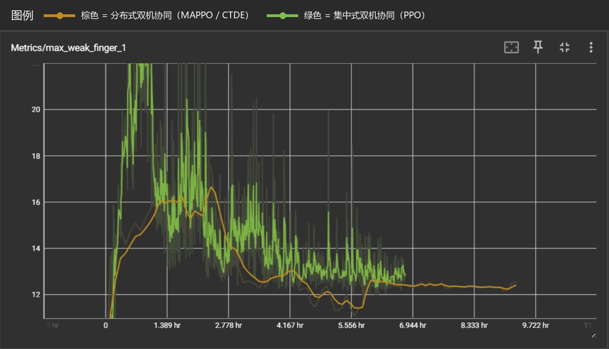

**含义**：无人机 1 的弱指最大接触力。

观察：

- 与无人机 0 类似，早期有较大碰撞峰值，后期下降并稳定。
- 棕色后期更平滑，绿色也回到合理区间。

解读：两台机器的左右指都能形成双指接触，不再是单指擦到杆。

### 11.11 `Metrics/success_rate`

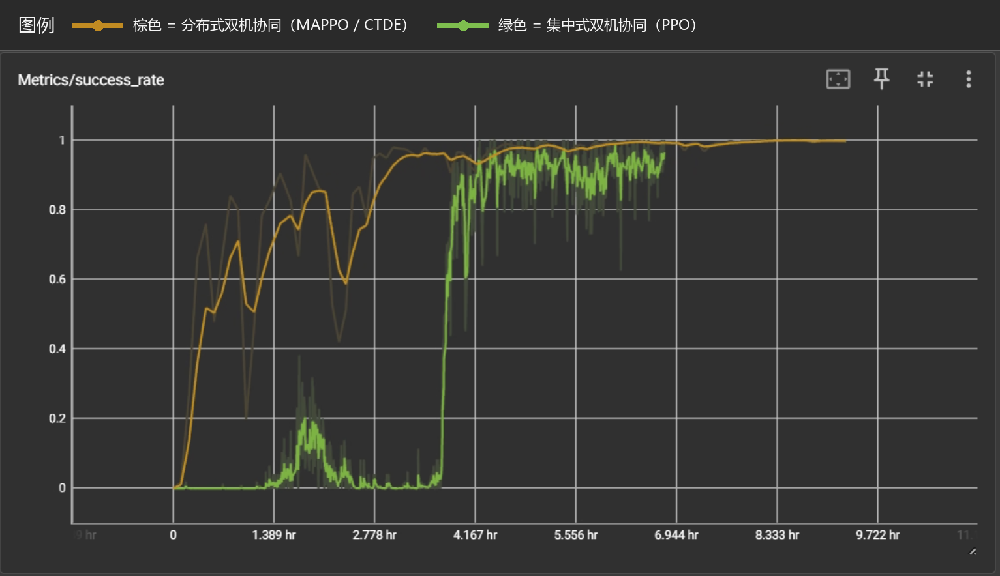

**含义**：严格成功率。条件是：杆到目标距离 < `success_dist=0.10m`，杆倾斜 < `success_tilt=0.05`，两机同时夹住，并保持 `success_hold_steps=50` 步（1 秒）。

观察：

- 棕色分布式较早冲到高成功率，并最终接近 1.0。
- 绿色集中式前期较慢，约 4h 附近跃迁后也接近 0.9-1.0。

解读：两种范式最终都能完成任务。分布式在这组曲线里更早进入成功平台，说明 `carry_ramp + lift_gate + hold_curriculum + 对称观测/通信` 对去中心化同步很有效。

---

## 12. 诊断失败模式

| 现象 | 可能原因 | 优先看/调什么 |
|---|---|---|
| `contact_rate_0/1` 低 | 单端抓取都没学会 | 看夹爪方向、`grasp_offset`、`base_rotate_center`、`contact_grasp`。 |
| `contact_rate_0/1` 高但 `all_contact_frac` 低 | 两台各自会夹，但不同步 | 调 `coop_grasp`、通信块、对称化、接触去抖。 |
| `all_contact_frac` 高但 `success_rate` 低 | 能同时夹住，但不会抬/搬/保持 | 看 `bar_goal`、`bar_level`、`hold_bonus`、`carry_ramp`、`lift_gate`。 |
| `max_bar_height` 早期很高 | 杆被甩飞或碰撞爆炸 | 看 `died`、`bar_still`、`carry_ramp_steps`、杆质量/阻尼。 |
| `max_weak_finger` 接近 0 | 只有一指接触 | 看夹爪开合轴、`grasp_z_offset`、`weak_grip`、接触传感器阈值。 |
| `max_weak_finger` 很高且 died 高 | 夹爪/杆强碰撞 | 降低 reset 穿模、增加 clearance、看夹爪 effort 和杆阻尼。 |
| `died` 长期不降 | 飞控/目标跳变/杆爆炸导致训练不稳定 | 看 LADRC 符号、`cog_ff_gain`、`carry_ramp_steps`、速度发散阈值。 |

---

## 13. 最终对照结论

| 维度 | 集中式绿色 | 分布式棕色 |
|---|---|---|
| 学习难度 | 策略直接看全局，理论上更容易协调 | actor 看局部，必须靠通信和 critic 引导同步 |
| 部署价值 | 中央统一控制，不够分布式 | 更接近真机多机部署 |
| 同步抓取 | 网络内部直接协调 | 依赖 egocentric 对称、共享权重、通信块、接触去抖 |
| 搬运稳定 | 可以直接跳目标，但仍可能有冲击 | 用 `carry_ramp_steps=60` 平滑抬升目标，防止去中心化跟踪不同步 |
| 奖励塑形 | 直接用严格 hold / 搬运奖励 | 使用 hold curriculum 和 lift gate，先引导再收紧 |
| 本组曲线表现 | 后期成功率接近 1，4h 附近跃迁明显 | 更早进入成功平台，最终也接近 1 |

> 集中式 PPO 证明了双机夹杆搬运任务在当前机构和 LADRC 底层控制下是可达的；分布式 MAPPO 在只使用本机观测和少量通信的情况下，通过中心化 critic、共享 actor、180 度对称化、接触去抖、carry ramp 与 lift gate，也达到了接近 100% 的成功率，因此更适合作为后续真机多机协作的部署路线。
